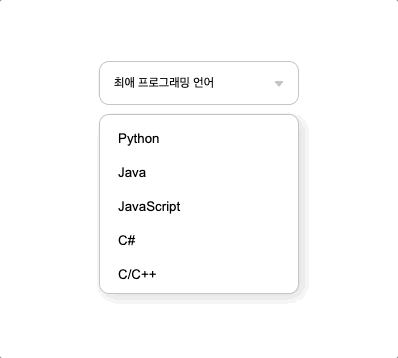

# dropdown-selectbox

## 구현 화면

  <br>
  
  <br>

완성페이지:http://127.0.0.1:5500/index.html

## 배운점

1. 길이가긴 텍스트 요소들을 위해 텍스트 말줄임 처리해주는 기능을 배웠다.
   - white-space: nowrap;으로 텍스트를 감싸주지 않는 형태로 만들어줘서 영역 밖으로 나가게 한다 (공백을만났을때 어떻게 할것인지 결정해주는 css defalt값은 wrap이며 nowrap을 사용하면 줄바꿈이 되지 않는다.)
   - overlfow:hidden; 으로 넘어간 부분을 안보이게 해준다.
   - text-overflow: ellipsis; ( 넘어간 부분들을 말줄임 처리해준다.) ui상 말줄임이 다른영역을 침범한다면 padding 값을 줘서 떨어트려 준다.

## 어려웠던점

1.원래는 `<select>`과 `<option>`을 사용해서 구현하려 했지만 `<option>`의 default 값으로 인해 css 설정을 해주는게 어려워서 `<ul>`,`<li>`태그로 대체하여 진행하였다.

- 아래태그는 `<select>`태그의 기존 default값인 화살표 모양을 초기화해주는 css코드이다.

  ```css
  select {
    -o-appearance: none;
    -webkit-appearance: none;
    -moz-appearance: none;
    appearance: none;
  }

  select::-ms-expand {
    display: none;
  }
  ```

2. 드롭다운버튼 클릭시 아이콘 이미지와 박스내의 요소 선택시 박스 값 변경기능을 구현하지 못했다.
   아이콘 이미지를 변경하는건 focus가상 선택자로 대체하였지만 후에 자바스크립트를 이용한다면 두개다 구현이 가능할듯 하다.

## 4월 19일 수정사항

1. 화살표 백그라운드 아이콘 변경 시 css 속성값을 background가 아닌 background-imge를 줘서 이미지만 교체하여 따로 포지션을 안줘도되서 코드의 길이가 줄어들었다.

2. 드롭박스 내의 텍스트가 길이가 길어지더라도 말줄임 기능을 구현해서 ui적으로 화면이 깨지지 않고 사용성이 좋게 수정해주었다.
